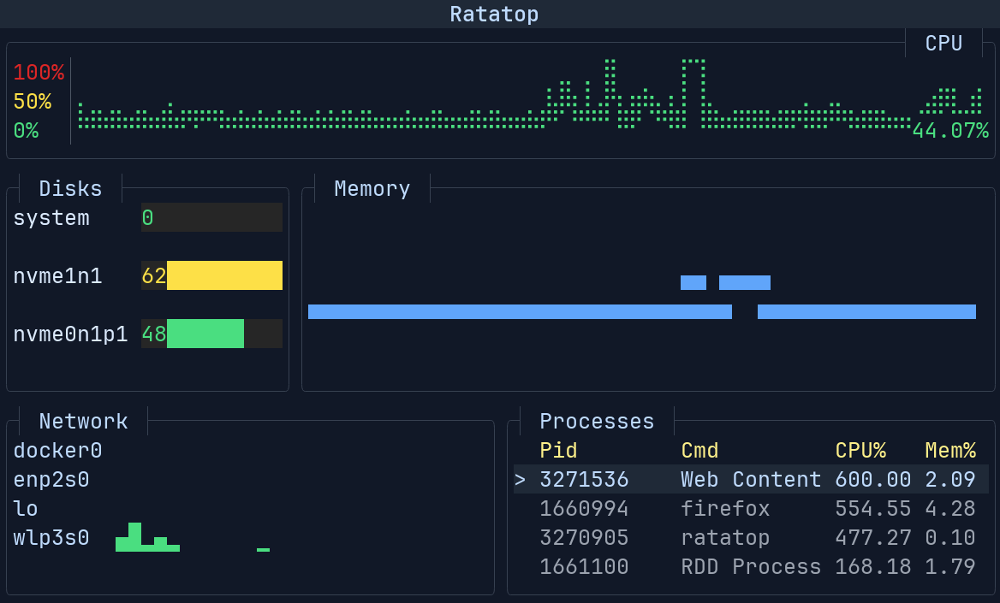

# Ratatui Workshop 👨‍🍳🐀


### What will you build?

"**Ratatop**", a terminal resource monitor application that displays system information in real-time.



### Who is this workshop for?

The workshop is intended for Rust beginners who want to learn how to build TUIs with Ratatui.
Previous experience with Rust is not required, but it is recommended to have a basic understanding of the language.

- If you are already familiar with Rust, you can still follow along and learn about Ratatui.
- If you are already familiar with Ratatui, you can follow the _bonus tracks_ and learn something new!

#### Necessary Tools

- [git](https://git-scm.com/)
- [cargo](https://www.rust-lang.org/tools/install)

> [!TIP]
> It is recommended to disable AI completions in your code editor to get a better understanding of the code you write.

### Chapters

The workshop is split up into 5 chapters and aims to be completed **in 2 hours.**

| Duration   | Chapter       | Topic                                                      |
| ---------- | ------------- | ---------------------------------------------------------- |
| **10 min** | **Chapter 1** | **Setup** - Install Rust, cargo-generate, create project   |
| **15 min** | **Chapter 2** | **Manage State** - Use `sysinfo`, refresh data             |
| **30 min** | **Chapter 3** | **Layout & Styling** - Define UI structure, apply styles   |
| **45 min** | **Chapter 4** | **Widgets** - Render charts, bar charts, sparklines, table |
| **20 min** | **Chapter 5** | **Interactivity** - Handle inputs, scroll table, search    |
| **-**      | 🧀            | **Q&A / Extras**                                           |

### Walkthrough

Use the [slides](presentation.md) to follow along with the workshop.

> [!TIP]
> You can use [`presenterm`](https://github.com/mfontanini/presenterm) to present the slides in your terminal.
>
> ```sh
> presenterm -c assets/presenterm.yml presentation.md
> ```

Start with installing [`cargo-generate`](https://github.com/cargo-generate/cargo-generate) and creating a new Ratatui project via [`templates`](https://github.com/ratatui/templates):

```sh
cargo install cargo-generate
```

```sh
# select the "simple" template
cargo generate ratatui/templates
```

Then follow the chapters to build the **Ratatop** application. If you get stuck, check out the [examples](./examples) folder which contains the completed code for each chapter. We recommend to try it yourself first and only refer to the example code in case you run into issues.

The final code can be found in the [src/main.rs](./src/main.rs) file.

## Show and tell! 🧀

Join the [Ratatui Discord](https://discord.gg/pMCEU9hNEj) and share your creations with the other terminal chefs!

If you have any questions or need help, feel free to ask in the chat.

## License

Copyright © 2025, [Orhun Parmaksız](https://github.com/orhun)

Licensed under [The MIT License](./LICENSE)

🦀 ノ( º \_ º ノ) - respect crables!
