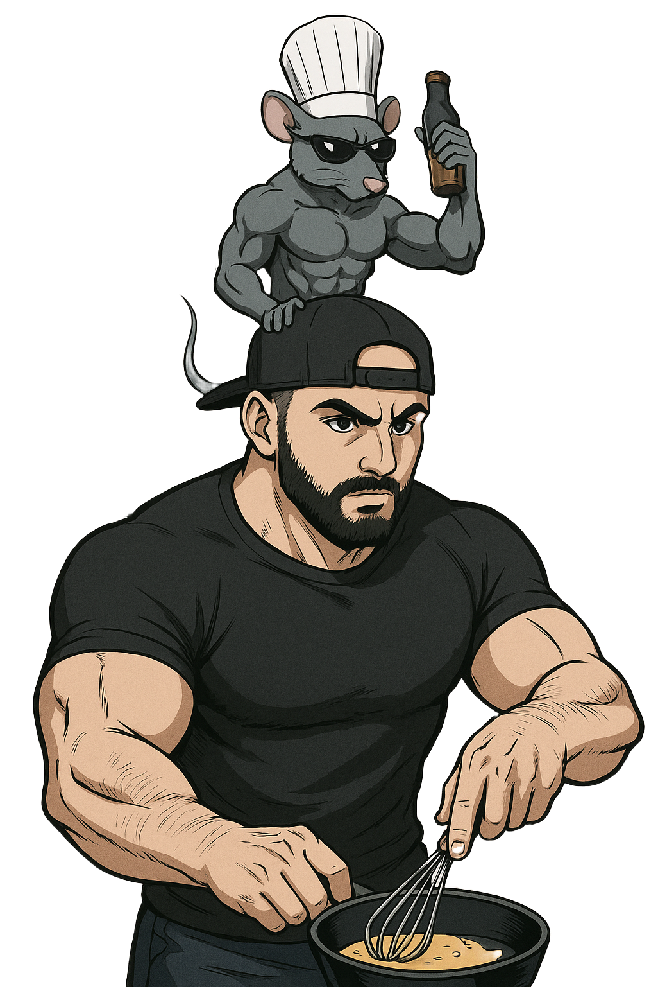

<!-- alignment: center -->


`Welcome to the workshop!`

[](https://github.com/orhun/rustforge2025-ratatui-workshop)

<!-- end_slide -->

<!-- column_layout: [1, 1] -->

<!-- column: 0 -->



<!-- column: 1 -->

<!-- new_lines: 2 -->

## **Orhun Parmaksız**

🐭 Lead maintainer of **Ratatui**

🇹🇷 Based in **Ankara, Türkiye**

📦 **Arch Linux** (btw)

🎹 Wannabe musician

(My talk "Rust Rocks" tomorrow!!!)

---

`https://github.com/orhun`

`https://youtube.com/@orhundev`

<!-- end_slide -->

# About the workshop

<!-- pause -->

<!-- column_layout: [3, 2] -->

<!-- column: 1 -->


<!-- column: 0 -->

## Goals

- Get started with Rust & Ratatui
- Grasp the terminal UI concepts
- Build a real-world application

<!-- pause -->

## Structure

- 3 hours in total
- Split up into 5 chapters
- Hands-on coding

<!-- pause -->

## Requirements

- Laptop with Rust installed
- Code editor with Rust support
- Terminal emulator (Wezterm, etc.)

<!-- pause -->

<!-- end_slide -->

# What are we gonna cook today?

```bash +exec +acquire_terminal
cargo run
```

<!-- end_slide -->

# Schedule

| Duration   | Chapter       | Topic                                                      |
| ---------- | ------------- | ---------------------------------------------------------- |
| **10 min** | **Chapter 1** | **Setup** - Install Rust, cargo-generate, create project   |
| **15 min** | **Chapter 2** | **Manage State** - Use `sysinfo`, refresh data             |
| **30 min** | **Chapter 3** | **Layout & Styling** - Define UI structure, apply styles   |
| **45 min** | **Chapter 4** | **Widgets** - Render charts, bar charts, sparklines, table |
| **20 min** | **Chapter 5** | **Interactivity** - Handle inputs, scroll table, search    |
| **60 min** | 🧀            | **Q&A** / **Debugging** / **Extras**                       |

<!-- end_slide -->

# Chapter 1 - Setup 🧀 (10 min)

<!-- column_layout: [1, 1] -->

<!-- column: 0 -->

## Objectives

• Install Rust using `rustup.rs` or any other way

• Install `cargo-generate`

• Generate a new Ratatui project

```bash
$ cargo generate ratatui/templates
```

<!-- column: 1 -->

## Bonus track

• Change the text

• Change the colors

<!-- end_slide -->

# Chapter 2 - Manage state 🧀 (15 min)

<!-- column_layout: [1, 1] -->

<!-- column: 0 -->

## Objectives

• Add `sysinfo` dependency

• Store `System` struct

• Refresh the data every 16ms

<!-- column: 1 -->

## Bonus track

• Create `App::refresh` method

<!-- end_slide -->

# Chapter 3 - Layout & styling 🧀 (30 min)

<!-- column_layout: [1, 1] -->

<!-- column: 0 -->

## Objectives

• Lay out the main application blocks

• CPU, Disks, Memory, Network, Processes

<!-- column: 1 -->

## Bonus track

• Add a one line header to the top with your app name

• Refactor rendering each block into its own function

• Render pretty borders and header

<!-- end_slide -->

# Chapter 4 - Widgets 🧀 (45 min)

<!-- column_layout: [1, 1] -->

<!-- column: 0 -->

## Objectives

• Render CPU via `Chart` widget

• Customize the `Chart` widget

• Render processes via `Table` widget

<!-- column: 1 -->

## Bonus track

• Render memory (`Chart`)

• Render disks (`BarChart`)

• Render network (`Sparkline`)

<!-- end_slide -->

# Chapter 5 - Interactivity 🧀 (20 min)

<!-- column_layout: [1, 1] -->

<!-- column: 0 -->

## Objectives

• Scroll the `Table` when `j`/`k` pressed

• Add text input via `tui-textarea`

• Show popup when `/` pressed

<!-- column: 1 -->

## Bonus track

• Search processes

• Kill the selected process

<!-- end_slide -->

# Extras (60 min)

<!-- column_layout: [1, 1] -->

<!-- column: 0 -->

• Q&A

• Show & tell!

• Start building your own app!

<!-- column: 1 -->


